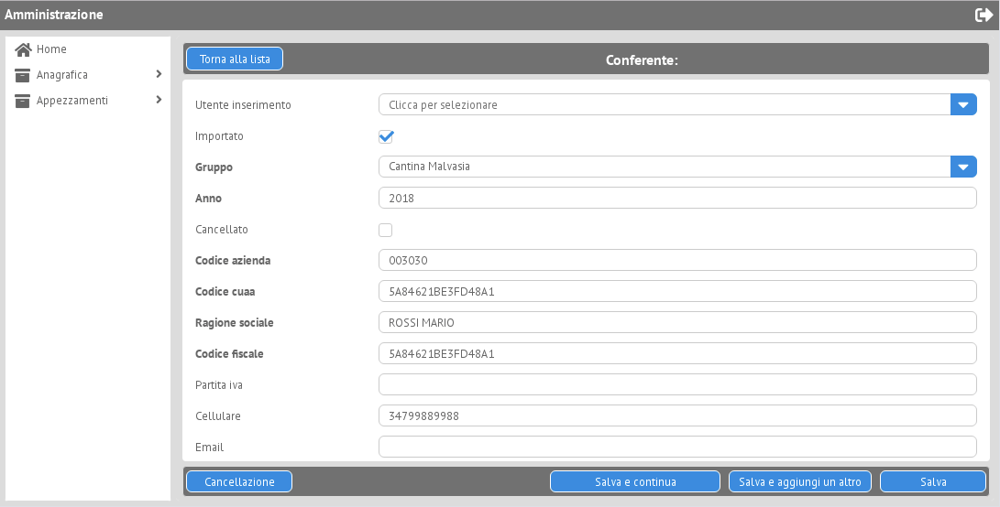

.. _Webix: https://webix.com

==========================
Django-Webix documentation
==========================

.. image:: static/django_webix_admin_list.png
  :alt: Django-Webix admin list example

   readme
   configuration

Django-Webix
============
* **Base:**
   ref/forms
   ref/views
   ref/urls
   ref/actions
   class-reference

Contrib
============
* **Admin:**
   contrib/admin/configuration
   contrib/admin/basic_usage
   contrib/admin/site
   contrib/admin/model
   contrib/admin/class-reference

* **Commands manager:**
   contrib/commands_manager/usage
   contrib/commands_manager/class-reference

* **Filter:**
   contrib/filter/usage
   contrib/filter/class-reference

* **Sender:**
   contrib/sender/usage
   contrib/sender/class-reference

* **Validator:**
   contrib/validator/usage
   contrib/validator/class-reference

Package info
============
   class-reference
   contributing
   authors
   changelog

Indices and tables
==================

* :ref:`genindex`
* :ref:`modindex`
* :ref:`search`
