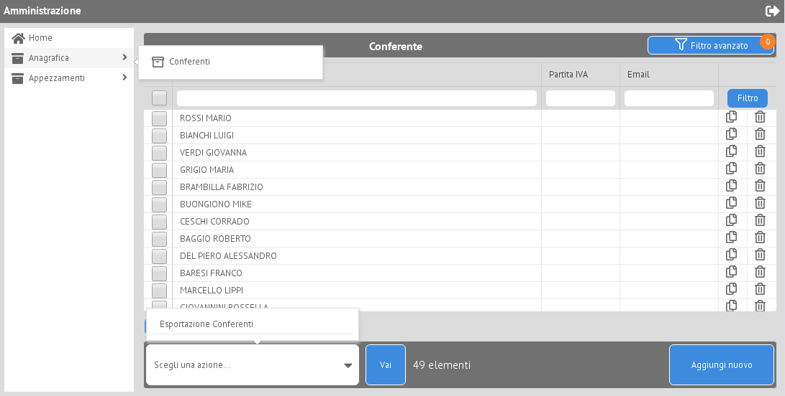
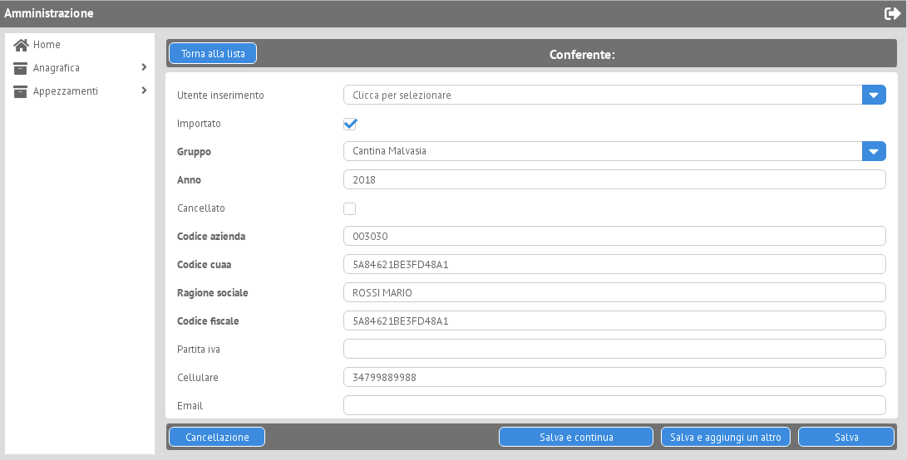

Admin
=====

Configure
---------

Settings
~~~~~~~~

Description

.. code-block:: python

    INSTALLED_APPS = [
        # ...
        'django_webix.admin_webix',
        # ...
    ]

Urls
~~~~

Register the views url (e.g. <project_name>/urls.py)

.. code-block:: python

    from django.conf.urls import url

    from <somewhere> import admin_webix

    urlpatterns = [
      path('admin_webix/', admin_webix.site.urls), # or another paths :-)
    ]

Basic Installation
-----

Admin Webix Site
~~~~~~~~~~~

For a basic usage it's enough register admin models on predefined site

.. code-block:: python

    from django_webix import admin_webix as admin

    @admin.register(XXXModelName)
    class XXXAdmin(admin.ModelWebixAdmin):
        pass

Advanced Installation
-----

Admin Webix Site
~~~~~~~~~~~

If an advanced use is needed it's enough extend default Site class.
Here an example:

.. code-block:: python

    import datetime

    from django.apps import apps
    from django.conf import settings
    from django.utils.functional import LazyObject
    from django.utils.module_loading import import_string

    class CustomSiteAdminWebixSite(LazyObject):
        def _setup(self):
            AdminWebixSiteClass = import_string(apps.get_app_config('admin_webix').default_site)

            def extra_index_context(self, request):
                if request.session.get('year',None) == None:
                    request.session['year'] = datetime.datetime.today().year
                return {
                    'DEBUG': settings.DEBUG,
                    'years': list(range(2020, datetime.datetime.today().year + 1)),
                }

            AdminWebixSiteClass.extra_index_context = extra_index_context
            self._wrapped = AdminWebixSiteClass()

        def each_context(self, request):
            return super().each_context(request)

        def dashboard(self, request, extra_context=None):
            return super().dashboard(request, extra_context)

        def extra_index_context(self, request):
            return {}

    custom_site = CustomSiteAdminWebixSite()

    # others customization parameters
    custom_site.site_title = gettext_lazy('Django webix site admin')
    custom_site.site_header = gettext_lazy('Django webix administration')
    custom_site.index_title = gettext_lazy('Site administration')
    custom_site.site_url = '/'
    custom_site.login_form = None
    custom_site.webix_container_id = 'content_right'
    custom_site.index_template = None
    custom_site.login_template = None
    custom_site.logout_template = None
    custom_site.password_change_template = None
    custom_site.password_change_done_template = None
    custom_site.webix_menu_type = 'sidebar' # 'menu'
    # for webgis support
    custom_site.webgis_template = 'webgis_leaflet/init.js'

Basic Usage
-----

Admin Webix
~~~~~~~~~~~

Create the files (e.g. <app_name>/admin_webix.py) and there is a simple example:
- prefix could be used for multiple model registration

.. code-block:: python

    from anagrafica.models import Conferente
    from appezzamenti.models import Appezzamento, UnitaVitata
    from django_webix import admin_webix as admin

    @admin.register(Conferente, prefix=prefix)
    class ConferenteAdmin(admin.ModelWebixAdmin):

        list_display = ['ragione_sociale', 'partita_iva', 'email']
        # could be directly dicts or use list_display_header for specific cutomization
        list_display_header = {
          'ragione_sociale': {
            'field_name': 'ragione_sociale',
            'datalist_column': '''
              {id: "ragione_sociale",
               header: ["Ragione sociale", {content: "serverFilter"}],
               adjust:"all",
               sort: "server",
               serverFilterType: "icontains",
               }'''
             }
        },
        enable_json_loading = True

    @admin.register(Appezzamento)
    class AppezzamentoAdmin(admin.ModelWebixAdmin):
        list_display = ['conferente__ragione_sociale', 'codice', 'denominazione']
        enable_json_loading = True

Advanced Usage
-----

Parameters
~~~~~~~~~~~

Create the files (e.g. <app_name>/admin_webix.py) and here there is an example of full list of parameters and funcions that can be override.

.. code-block:: python

    from anagrafica.models import Conferente
    from appezzamenti.models import Appezzamento, UnitaVitata
    from django_webix import admin_webix as admin

    # INLINE
    class IndiceStambeccoInline(IndiceInlineMixin, WebixStackedInlineFormSet):
        model = IndiceStambecco
        form_class = IndiceStambeccoForm

    # ACTION
    @action_config(action_key='validazione',
                   response_type='json',
                   short_description='Validazione, investimenti e rinvenimenti',
                   allowed_permissions=['delete'])
    def validazione_trimestrale(self, request, qs):
        user = request.user
        stazioni = []
        if user.get_profilo().direttore_distretto:
            stazioni = user.get_profilo().stazioni_forestali.values_list('ogc_fid', flat=True)
        qs = qs.filter(Q(tipo_dato=TipoDato.objects.get(codice='rinvenimento')) |
                       Q(tipo_dato=TipoDato.objects.get(codice='investimento'))
                       )

        if not user.is_admin():
            qs = qs.filter(stazione_forestale__in=stazioni)
        count = int(qs.count())
        qs.update(validata=True)
        return JsonResponse({
            "status": True,
            "message": '{count_delete_instances} schede sono state validate e non sono piu modificabili'.format(
                count_delete_instances=count),
            "redirect_url": self.get_url_list(),
        }, safe=False)

    @admin.register(Conferente)
    class ConferenteAdmin(admin.ModelWebixAdmin):
        # WEBIX VIEWS (for fully override)
        create_view = None
        update_view = None
        delete_view = None
        list_view = None

        # JS TEMPLATES
        add_form_template = None
        change_form_template = None
        change_list_template = None
        delete_template = None
        dashboard_template = 'admin_webix/dashboard.js'

        # CREATE AND UPDATE SETTINGS
        enable_button_save_continue = True
        enable_button_save_addanother = True
        enable_button_save_gotolist = True

        # DJANGO WEBIX FORM: OPTION 1
        autocomplete_fields = []
        readonly_fields = []
        fields = None
        exclude = None
        # DJANGO WEBIX FORM: OPTION 2
        form = None

        inlines = [IndiceStambeccoInline]

        # LIST SETTINGS
        ordering = None
        actions = [multiple_delete_action, validazione_trimestrale]
        list_display = [
            {
                'field_name': 'codice',
                'datalist_column': '''{id: "codice", serverFilterType:"icontains", header: ["{{_("Codice appezzamento")|escapejs}}", {content: "serverFilter"}], adjust: "all", sort: "server"}'''
            },
            {
                'field_name': 'numero_piante_sintomatiche',
                'click_action': '''set_webgis_item('Appezzamento', [el['id']], el['bbox']);''',
                'footer': Sum('numero_piante_sintomatiche'),
                'datalist_column': '''{id: "numero_piante_sintomatiche", serverFilterType:"icontains", header: ["{{_("Numero piante sintomatiche")|escapejs}}", {content: "serverFilter"}], adjust: "all", sort: "server"}'''
            },
        ]
        extra_header = {}

        enable_json_loading = False
        pk_field = None
        title = None
        actions_style = None
        enable_column_copy = True
        enable_column_delete = True
        enable_row_click = True
        type_row_click = 'single'
        enable_actions = True
        remove_disabled_buttons = False

        # permission custom
        only_superuser = False

        def get_list_display(self, request=None):
            pass

        def is_webgis_enable(self):
            pass

        def is_webix_filter_enable(self):
            pass

        def get_model_perms(self, request):
            return {
                'add': self.has_add_permission(request),
                'change': self.has_change_permission(request),
                'delete': self.has_delete_permission(request),
                'view': self.has_view_permission(request),
            }

        def has_add_permission(self, request):
            if self.get_queryset(request=request).exists():
                return False
            else:
                return True

        def get_failure_add_related_objects(self, request):
            return []

        def get_failure_change_related_objects(self, request, obj=None):
            return []

        def get_failure_delete_related_objects(self, request, obj=None):
            return []

        def get_failure_view_related_objects(self, request, obj=None):
            return []

        def get_info_no_add_permission(self, has_permission, request):
            if not has_permission:
                return [_("You haven't add permission")]
            return []

        def get_info_no_change_permission(self, has_permission, request, obj=None):
            if not has_permission:
                return [_("You haven't change permission")]
            return []

        def get_info_no_delete_permission(self, has_permission, request, obj=None):
            if not has_permission:
                return [_("You haven't delete permission")]
            return []

        def get_info_no_view_permission(self, has_permission, request, obj=None):
            if not has_permission:
                return [_("You haven't view permission")]
            return []

        def get_queryset(self, request):
            qs = super().get_queryset(request=request).filter(anno=request.session.get('anno', 0))
            if request.user.is_nucleo():
                qs = qs.filter(nucleo__userprofile__user=request.user)
            return qs.distinct()

        def get_add_view(self):
            AddView = super().get_add_view()

            def pre_forms_valid(self, form=None, inlines=None, **kwargs):
                form.instance.anno = self.request.session['anno']
                form.instance.nucleo = self.request.user.get_profilo().nucleo
            AddView.pre_forms_valid = pre_forms_valid

            return AddView
